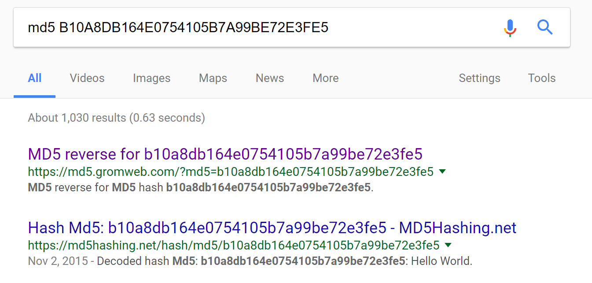
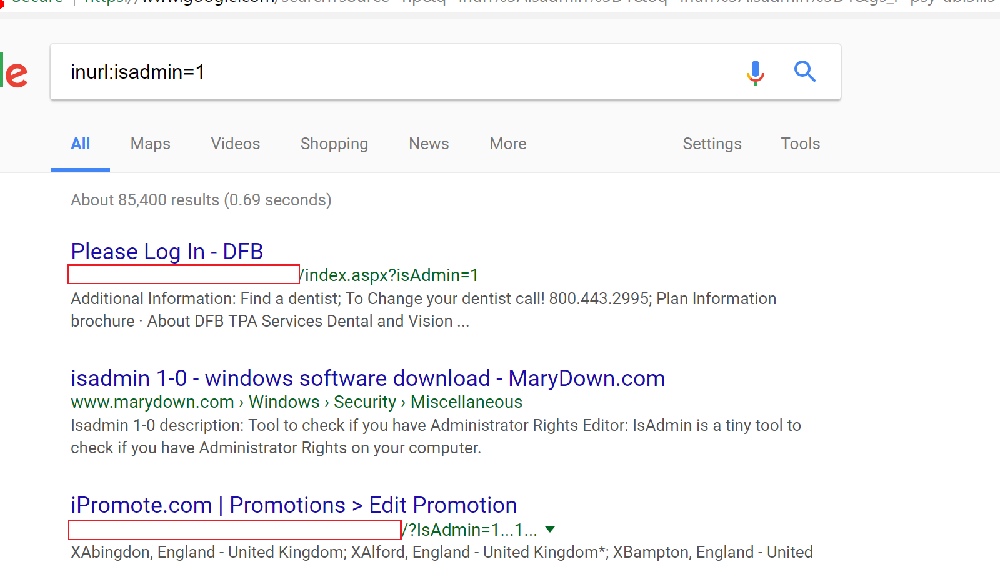
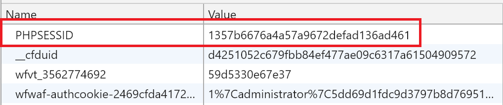
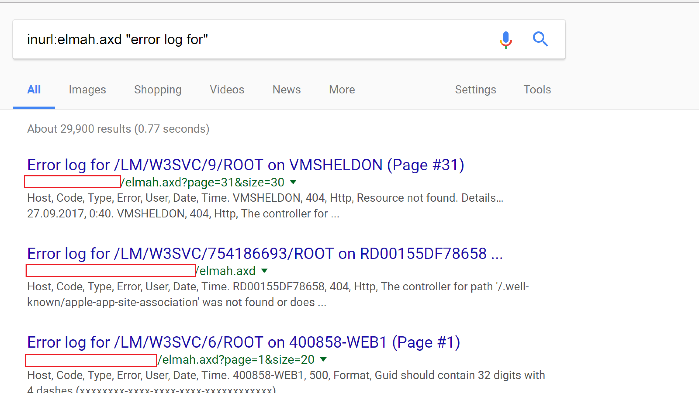
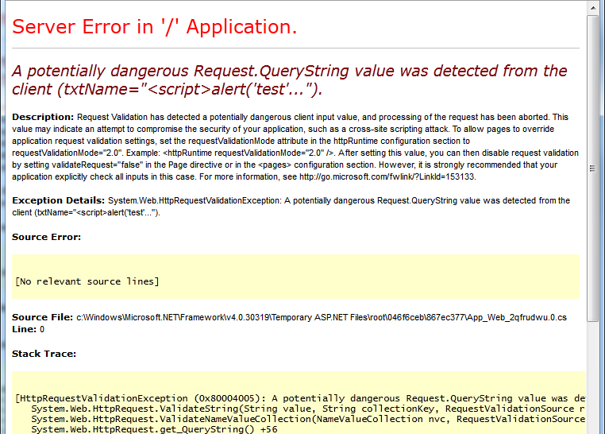

<style>
.reveal section img { background:none; border:none; box-shadow:none; }
</style>

## A .NET Developer's View Of The OWASP Top 10

<a href="http://www.catallaxyservices.com">Kevin Feasel</a> (<a href="https://twitter.com/feaselkl">@feaselkl</a>)
<a href="http://csmore.info/on/owasp">http://CSmore.info/on/owasp</a>

---

@title[Who Am I?]

@snap[west splitscreen]
<table>
	<tr>
		<td><a href="https://csmore.info"></a></td>
		<td><a href="https://csmore.info">Catallaxy Services</a></td>
	</tr>
	<tr>
		<td><a href="https://curatedsql.com"></a></td>
		<td><a href="https://curatedsql.com">Curated SQL</a></td>
	</tr>
	<tr>
		<td><a href="https://wespeaklinux.com"></a></td>
		<td><a href="https://wespeaklinux.com">We Speak Linux</a></td>
	</tr>
</table>
@snapend

@snap[east splitscreen]
<div>
	<a href="http://www.twitter.com/feaselkl"></a>
	<br />
	<a href="http://www.twitter.com/feaselkl">@feaselkl</a>
</div>
@snapend

---

### OWASP

The Open Web Application Security Project is an online community founded in 2001 with the goal of improving software security.

As an organization, they release free penetation testing tools, write books on software security, and host user groups with chapters all around the world.

---

### OWASP Top 10

One of the major contributions OWASP makes to application security is the OWASP Top 10 Application Security Risks, a periodic survey of which application security risks are most prevalent.

The latest edition is 2017, with prior editions in 2013, 2010, 2007, and 2003.  The authors combine data breach analysis, practitioner surveys, and the shared expertise of leaders in the field to distill the ten largest web application security risks at the present time.

---?image=presentation/assets/background/motivation.jpg&size=cover&opacity=20

### Motivation

Reviewing the top ten threats will help us get a bearing on what is happening in the industry today.  Many of the top ten threats persist over time, indicating that these tend not to be ephemeral risks.

As a logistical note, covering ten threats means we will spend an average of five minutes per threat.  This will limit how detailed we can get on any single threat, but I will have resources available if you wish to dig deeper into a particular topic.

---

@title[Injection]

## Agenda
1. **Injection**
2. Broken Authentication
3. Sensitive Data Exposure
4. XML External Entities
5. Broken Access Control
6. Security Misconfiguration
7. Cross-Site Scripting
8. Insecure Deserialization
9. Using Components with Known Vulnerabilities
10. Insufficient Logging and Monitoring

---

### Injection

SQL injection is the most common injection attack, but there are others, including LDAP injection, XPATH injection, CSV injection, etc.

Injection attacks are possible whenever we are building strings which include untrusted information in one context to execute in another context.  This is most common when crossing language and tier boundaries.

---

### Injection

SQL Injection attacks are a solved problem, yet they remain at the top of the OWASP Top 10 list because SQL injection is such an easy vector of attack and typically, websites with SQL injection vulnerabilities tend to have a host of other problems, including using sysadmin for application access and providing open access to sensitive information.

In this sense, the existence of SQL injection is an organizational bellwether:  if it fails this extremely simple test, it likely has failed others.

---

### Solutions

The single best thing you can do to protect against SQL injection is to <strong>parameterize your queries</strong>.  Non-terrible ORMs and stored procedures can both do this, though it is possible to misuse either.  If you feel the urge to execute SQL passed in as a parameter, don't do it.

---

### Solutions

From there, <strong>whitelists</strong> work.  Use whitelists to limit the domain of valid values (easy in the case of numeric or enumeration data types).  Use regular expressions if it makes sense.  These whitelists should be at every level you can think of:  UI, backend application, and database.  This is a case where defense in depth makes good sense.

Blacklisting particular words is <strong>not</strong> a good solution because industrious people will find ways around your blacklist.

---

### Solutions

You can also use a <strong>Web Application Firewall</strong> to intercept potentially malicious queries.  These prevent many potential attacks from getting through but they are not perfect.  It is possible to bypass Web Application Firewalls once you understand how they behave, but they will protect against the majority of noise.

---

### More Details

If you want a more detailed analysis of SQL injection, I have a talk on the topic:  <a href="https://CSmore.info/on/sqli">https://CSmore.info/on/sqli</a>.  Or grab a copy of the book <a href="http://tribalsql.com/">Tribal SQL</a>, in which I contributed a chapter on SQL injection.

---

@title[Broken Authentication]

## Agenda
1. Injection
2. **Broken Authentication**
3. Sensitive Data Exposure
4. XML External Entities
5. Broken Access Control
6. Security Misconfiguration
7. Cross-Site Scripting
8. Insecure Deserialization
9. Using Components with Known Vulnerabilities
10. Insufficient Logging and Monitoring

---

### Broken Authentication

Broken authentication and session management includes flaws in the frameworks we use for authentication or session management.  If an attacker is able to do something like access exposed accounts or passwords or hijack a session ID, that attacker can now impersonate a valid user.

---

### Broken Authentication

A common example of poor authentication is keeping the session ID in the query string or as part of the URL.  If this is your primary authentication mechanism, it's a bad idea because someday, one of your users will tweet a link to your site.

---

### Solutions

Store sensitive information in cookies rather than as part of the querystring or URL.  It is possible to make the latter work securely but it involves a lot more work.  ASP.Net defaults to use cookies only.

If you want to screw up, you can do so with this web.config setting:

`<sessionState cookieless="UseURI" />`

---

### Solutions

Use tried and tested authentication methods rather than rolling your own.  These are less likely to have major security vulnerabilities than code written by a team of non-specialists.  In .NET, there is the ASP.Net MVC Identity system.

---

### Solutions

Add two-factor authentication (2FA).  There are several NuGet packages which tie together the Microsoft Identity Framework and Google Authenticator.  <a href="https://www.owasp.org/index.php/Adding_two-factor_authentication_to_ASP.NET">OWASP also has a tutorial on using one of them</a>.

---

### Other Advice

Find a good tradeoff between convenience and security with respect to timeouts.  Leaving a person signed in longer is convenient, but expands the window that an attacker has to squirm into a session.

---

### Other Advice

There are two timeout techniques:  sliding window and fixed-length.  With sliding window timeouts, you have a 30-minute (or so) window and each activity pushes the endtime back to 30 minutes.  With fixed-length timeouts, you have a hard stop regardless of activity.If you want a fixed-length timeout, modify the web.config thusly:

`<forms slidingExpiration="false" >`

---

### Other Advice

* Store credentials securely.  We'll cover good password security later.
* Use robust minimum password criteria.  Don't cap password lengths please!
* Never send passwords via e-mail.  In fact, you shouldn't know user passwords for your site--that's not secure.
* Protect session IDs which are in cookies by using HTTPS to transmit cookies and protecting against cross-site scripting risks.

---

@title[Sensitive Data Exposure]

## Agenda
1. Injection
2. Broken Authentication
3. **Sensitive Data Exposure**
4. XML External Entities
5. Broken Access Control
6. Security Misconfiguration
7. Cross-Site Scripting
8. Insecure Deserialization
9. Using Components with Known Vulnerabilities
10. Insufficient Logging and Monitoring

---

### Sensitive Data Exposure

Encrypt sensitive data that you need to access later.  This includes data in databases, data in configuration files, data in backups, data in extracts, etc.

For data that you don't need to access later (like plaintext passwords to your systems), keep a hash of the data.  But don't use algorithms like MD5 or SHA1; they're fine for many uses, but <strong>not</strong> for secure hashes.

---

### Solutions

Use strong adaptive algorithms for password storage.  Use key derivation functions like <strong>PBKDF2</strong> and password hashes like <strong>bcrypt</strong>, <strong>scrypt</strong>, or <strong>Argon2i</strong>.  Use a large number of iterations with a good salt.

ASP.Net MVC 4 crypto uses PBKDF2 with 1000 iterations, but you cannot customize the number of iterations.

Zetetic has a NuGet package which uses BCrypt and 5000 iterations of PBKDF2.

---

### Solution History

Each method has its own weaknesses:

* PBKDF2 is weak against GPUs
* BCrypt is weak against FPGAs (exponential CPU but not exponential memory)
* SCrypt is strong against FPGAs (exponential CPU and exponential memory) but is newer (2009 versus 1999) and not quite as vetted
* The Argon2 series is even newer than SCrypt (2015) but you can scale memory and CPU independently

---

### Performance versus Safety

At its best, brute force is required to break hashing.  With a good hash strategy (i.e., making hashing slow), it is not financially viable to perform a brute force attack.

The downside to slow hashing is that it's easier to perform a denial of service attack with mass login attempts.

Be sure to salt your hashes.  A salt is a random set of bytes which are added to a password before it is hashed.  You want a separate salt per hashed item.

---

### Taste the Rainbow Table

Without a good hash + salt, an attacker can use a rainbow table, which is a reverse lookup from hash to plaintext.



---

### Key Types

When you need to encrypt data, know the difference between symmetric and asymmetric keys.  Symmetric keys are good for internal data like credit card info, where the same machine encrypts and decrypts the data.

Asymmetric keys are good when you want different computers to communicate data back and forth.

---

### Key Security

Whichever you choose, secure the keys.  Don't store them in source control or config files.  Use the Data Protection API.

`System.Security.Cryptography` has `ProtectedData.Protect` and `Unprotect`.

Valid scopes:  `CurrentUser` and `LocalMachine`.

---

### Other Tips

* Use a modern version of TLS to transmit all information.  TLS 1.3 is out and 1.2 is still fine.
* Discard unnecessary stored data as soon as possible and don't store what you don't need.
* Disable autocomplete on sensitive forms and disable caching on pages with sensitive data.

---

@title[XML External Entities]

## Agenda
1. Injection
2. Broken Authentication
3. Sensitive Data Exposure
4. **XML External Entities**
5. Broken Access Control
6. Security Misconfiguration
7. Cross-Site Scripting
8. Insecure Deserialization
9. Using Components with Known Vulnerabilities
10. Insufficient Logging and Monitoring

---

### XML External Entities

XML External Entity Injection (XXE) is an injection attack against XML parsers.  It takes advantage of the XML spec, which allows for entities within XML.  Entities are macros or placeholders that you can define in an XML file.

Those entities can also include filesystem files.  XXE attacks happen when an attacker uses an XML External Entity to load data the attacker would otherwise not be able to access.

---

```xml
<!DOCTYPE doc [
	<!ENTITY user "Bob">
	<!ENTITY accessLevel "medium">
	<!ENTITY favoriteColor "blue">
	<!ENTITY greeting "Hello, &user;.  I see your access
		level today is &accessLevel; and your favorite
		color is &favoriteColor; - that's my favorite
		color too!">
]>
<doc>&greeting;</doc>
```
@[1-9](An XML document with external entities.)
@[2](Define the "user" entity with the value "Bob")
@[3-4](Define the "accessLevel" and "favoriteColor" entities.)
@[5-8](Define the "greeting" entity using prior entities.)
@[10](Display the value in the "greeting" entity.)

---

### These Look Familiar

You've used entities before:  <em>&amp;amp;</em> for ampersand, <em>&amp;gt;</em> and <em>&amp;lt;</em> for comparison operators, etc.  Browsers support only a built-in set of XHTML entities.

Why don't browsers support custom XML external entities?

---

### XXE Injection Attacks

Our attack can take advantage of entities, specifically importation of external entities:

```xml
<?xml version="1.0" encoding="ISO-8859-1"?>
<!DOCTYPE credgatherer [ <!ELEMENT creds ANY >
<!ENTITY xxe SYSTEM "file:///etc/passwd" >]>
<creds>
    <user>&xxe;</user>
    <pass>mypass</pass>
</creds>
```
@[2-3](Define what you'd like to see, including external resources.)
@[4-7](Get the results in an XML document.)

---

### .NET Parsers

Safe by default:
* LINQ to XML
* `XmlDictionaryReader`
* `XmlNodeReader`
* `XmlReader`
* `XslCompiledTransform`

---

### .NET Parsers

Safe in .NET 4.5.2 or later and **unsafe** before:
* `XmlDocument`
* `XmlTextReader`
* `XmlPathNavigator`

---

### What "Safe" Means

Safety here usually means prohibiting DTDs (Document Type Definitions).  As of .NET 4.0, you have three options:  prohibit DTDs and throw an exception if you receive a file with a DTD; ignore the DTD but parse the file otherwise; or parse the DTD.

---

### What "Safe" Means

You should <strong>never</strong> accept untrusted XML documents with DTDs.  Unless you know the origin of the XML file and can ensure that there are no external entity references, you should ignore or prohibit DTDs.

---

```csharp
static void LoadXML()
{
  string xml = "<?xml version=\"1.0\" ?><!DOCTYPE doc 
	[<!ENTITY win SYSTEM \"file:///C:/Temp/SampleData.txt\">]
	><doc>&win;</doc>";

  XmlDocument xmlDoc = new XmlDocument();
  xmlDoc.XmlResolver = null;   // Setting this to NULL disables DTDs
  xmlDoc.LoadXml(xml);
  Console.WriteLine(xmlDoc.InnerText);
  Console.ReadLine();
}

```
@[3-5](Inject a path request in an XML file.)
@[6-8](Setting `XmlResolver` to `null` disables DTDs.  This is the secure approach.)

---?image=presentation/assets/background/demo.jpg&size=cover&opacity=20

### Demo Time

---

### Final Recommendation

<strong>Always</strong> explicitly prohibit DTDs, as that way you're sure to be safe.  Don't rely on defaults.

---

@title[Broken Access Control]

## Agenda
1. Injection
2. Broken Authentication
3. Sensitive Data Exposure
4. XML External Entities
5. **Broken Access Control**
6. Security Misconfiguration
7. Cross-Site Scripting
8. Insecure Deserialization
9. Using Components with Known Vulnerabilities
10. Insufficient Logging and Monitoring

---

### Broken Access Control

This risk is that authorized users might be able to change parameters in your application and gain access to information that they were not authorized to see.

For example, if I see http://mysite.com/customers/32144, what happens when I try to go to /customers/32145?  Or /customers/32143?

Or if I try IsAdmin=1?

---

### Broken Access Control



---

### Solutions

With surrogate keys, use nonguessable values.  Incrementing keys are great for database performance, but make it too easy for an end user to guess other people.

A solution here is <strong>indirect object references</strong>.

---

### Indirect Object References

Build a <strong>reference map</strong>:  translate a direct reference to an indirect reference (and vice versa).

You can use `System.Security.Cryptography.RNGCryptoServiceProvider` to generate cryptographically random strings, and create a hashtable to support those translations back to your database keys.

---

### Indirect Object References



---

### Access Control

Perform access control checks.  Make sure the user is authorized to see this set of data.  Don't assume that having a link is the same as having authorization to that data.

Indirect object references are a supplement; access control checks are the primary winner here.

---

@title[Security Misconfiguration]

## Agenda
1. Injection
2. Broken Authentication
3. Sensitive Data Exposure
4. XML External Entities
5. Broken Access Control
6. **Security Misconfiguration**
7. Cross-Site Scripting
8. Insecure Deserialization
9. Using Components with Known Vulnerabilities
10. Insufficient Logging and Monitoring

---

### Security Misconfiguration

Security misconfiguration is all about insecure configuration settings.  As an example, leaving files with sensitive information accessible to the public would be misconfiguration--think password files, web.configs, etc.

You might also be displaying error messages with sensitive information:  deployed code folders, internal source code, call stacks, framework/server versions, data sources and passwords, etc.

---

### Security Misconfiguration

Good idea:  using Elmah to store log data.
Bad idea:  exposing Elmah data to the broader internet.



---

### Security Misconfiguration

What's in your S3 bucket?  There are thousands of public S3 buckets with interesting information like:

* 198 million US voter profiles
* 14 million Verizon customer records
* Millions of Dow Jones customer records

Rapid7 estimated in 2013 that one in six S3 buckets are available to the public.  Many of those contain no sensitive information and are not risks, but some of them do have data their owners would rather not have generally available.

---

### Solutions

Set custom errors on:

```xml
<customErrors mode="On" defaultRedirect="Error.aspx"
	redirectMode="ResponseRewrite" />
```

(Or use RemoteOnly).

This creates a custom page and redirectMode hides that there was ever an error and never shows the end user that there was a 500 error.  This will cause the web purists pain but prevents potential configuration exposure.

---

### Solutions

Secure trace.asd.  Limit what you write to trace.  For example, don't write connection strings to the trace.  In web.config, you can easily turn it off: 

```xml
<trace enabled="false">
```

---

### Other Solutions

* Keep libraries & apps up to date
* Disable or remove unnecessary ports, services, pages, accounts, privileges, etc.
* Encrypt sensitive web.config details

---

### Web.Config Encryption

In an administrative command prompt, run: 

```
aspnet_regiis -site "sitename" -app "/" -pe "connectionStrings"
```

This uses the RSA key on the server to perform symmetric encryption on web.config's connection strings.

---

### Security at Compile Time

* Use web.config transformations to configure defensively on deployment, removing debugging and tracing logic just in case somebody accidentally includes it in the build.
* Ensure security within the build.  For example:  fail the build if you have the debug flag set.

---

@title[Cross-Site Scripting]

## Agenda
1. Injection
2. Broken Authentication
3. Sensitive Data Exposure
4. XML External Entities
5. Broken Access Control
6. Security Misconfiguration
7. **Cross-Site Scripting**
8. Insecure Deserialization
9. Using Components with Known Vulnerabilities
10. Insufficient Logging and Monitoring

---

### Cross-Site Scripting

Cross-site scripting is where you get a user to execute unexpected code on a website.  It is very similar to injection attacks, but focuses around JavaScript, CSS, or HTML rather than SQL, LDAP, etc.

---

### Cross-Site Scripting

There are two major themes with XSS:  reflected and persistent.

<strong>Reflected</strong> XSS is where an attacker sends a modified link, adding malicious querystring data.  Typically, the attacker distributes the link via e-mail, social media, and on forums.  Without the link, a potential victim would not see XSS.

<strong>Persistent</strong> XSS is where an attacker is able to save malicious code in a database and have it appear without needing a reflection link.

---

### Cross-Site Scripting

There are several things you can do once you have exploited a Cross-Site Scripting vulnerability.  You can run arbitrary scripts, access objects in the DOM, and even redirect unwary users to another site, such as a phishing site meant to harvest credentials.

---

### Solutions

Beat XSS with defense in depth.  First, use an output encoding library.  Microsoft has the Anti-XSS framework, which is built into .NET now:  `System.Web.Security.AntiXss` has `AntiXssEncoder.HtmlEncode()` and `HtmlDecode()` methods, as well as encoders and decoders for CSS, JavaScript, URLs, and XML.

---

### Solutions

NuGet also has the AntiXSS library, meant for old versions of the .NET Framework prior to when they built this in.  This library can encode JavaScript, XML, LDAP, CSS, etc. code.  For example:  

```csharp
Microsoft.Security.Application.Encoder.
	JavaScriptEncode("some string");
```

---

### Solutions

If you're using ASP.NET MVC, the Razor view engine auto-encodes by default when you use `@object` or `Html.Encode()`.  If you want to restore markup, use `Html.Raw()`.

---

### Solutions

<strong>Whitelists</strong> are a viable solution, like with injection attacks.  The encoding in the libraries above is a fancy form of whitelist, but you can build your own regular expressions as well to create custom whitelists.

---

### Potentially Dangerous Request

Ever get this error?



---

### Potentially Dangerous Request

.NET automatically validates page inputs and protects you against accepting potential malicious scripts...but it can be a little too aggressive, like throwing this `HttpRequestValidationException` on a password column with `<` in it.

---

### Potentially Dangerous Request

In general, you want these protections, so go to web.config and make sure to set: 

```xml
<pages validateRequest="true">
```

---

### Potentially Dangerous Request

But you might want to narrow that down a bit.  You can do this at the page level:  

```xml
<@ Page ValidateRequest="false" OtherAttrs="OtherValues" >
```

In .NET 4.5 or later, you can enable or disable request validation for individual WebForms controls, like a password box.

---

### Ignore Encoding

For ASP.Net MVC, you can decorate model attributes to ignore enoding: 

```csharp
[AllowHtml]
public string Password { get; set; }
```

---

### Browser Headers

You can use the `X-XSS-Protection` browser header to add an additional layer of protection against Cross-Site Scripting attack attempts.  This works for pretty much every browser except Firefox.

---

### Content Security Policies

You can use Content Security Policies to define valid domains and subdomains for:

* JavaScript
* Cascading Stylesheets
* Images
* Fonts
* HTML5 Media (audio, video, etc.)
* Child frames

---

@title[Insecure Deserialization]

## Agenda
1. Injection
2. Broken Authentication
3. Sensitive Data Exposure
4. XML External Entities
5. Broken Access Control
6. Security Misconfiguration
7. Cross-Site Scripting
8. **Insecure Deserialization**
9. Using Components with Known Vulnerabilities
10. Insufficient Logging and Monitoring

---

### Insecure Deserialization

Deserialization attacks came onto the scene in 2015, when security researchers found serialization vulnerabilities in Java.  Attackers could perform remote code execution by sending serialized code to applications which use Java's "commons collections" library, a very popular library.  Vulnerable applications included WebLogic, WebSphere, JBoss, Jenkins, etc.

Since then, we've learned that .NET applications are also vulnerable.

---

### Insecure Deserialization

In .NET, Breeze and NancyFX had JSON deserialization flaws.  There was also an XML deserialization flaw in DotNetNuke.

Newtonsoft's JSON.Net parser is relatively safe, but Breeze was vulnerable due to coding choices.  Breeze configured JSON.Net to use <code>TypeNameHandling.All</code> and had a Tag object in its SaveOptions class:

```csharp
public class SaveOptions {
 public bool AllowConcurrentSaves { get; set; }
 public Object Tag { get; set; }
}
```

---

### Insecure Deserialization

If you deserialize into a `FileSystemInfo` object and an attacker sends a string where part of the path begins with `~` (e.g., `\\SomeServer\~MyShare`), then Windows automatically calls `GetLongPathName()` on the string.  If the path is a UNC path, Windows makes an SMB request, and an attacker might be able to perform SMB credential relaying if the attacker is on your local network.

---

### Solutions

Serialize <strong>data</strong>, not objects.  If you have straight data in JSON or XML format and you prevent your deserializer from converting untrusted serialized inputs into objects, you should be safe.

Deserialize objects into specific defined types, ideally classes within custom assemblies.  Don't deserialize to Object, IRunnable, or other low-level classes or interfaces.  Sealed classes can help here.

Never deserialize untrusted binary objects.

---

### Other Solutions

* Don't serialize delegates--attackers can use delegates to execute arbitrary code.
* Don't use .NET remoting.  If you need remoting, you deserve what you get with WCF.  Better just not to use remoting at all.
* If you generate the message, sign the messages as part of the serialization process and refuse to deserialize messages which are not signed.

---

@title[Using Components with Known Vulnerabilities]

## Agenda
1. Injection
2. Broken Authentication
3. Sensitive Data Exposure
4. XML External Entities
5. Broken Access Control
6. Security Misconfiguration
7. Cross-Site Scripting
8. Insecure Deserialization
9. **Using Components with Known Vulnerabilities**
10. Insufficient Logging and Monitoring

---

### Using Broken Stuff

Things to think about:

* Old encryption cyphers
* Old HTTP security protocols (e.g., TLS 1.0 or 1.1)
* Software with known backdoors or malicious components

---

### Using Broken Stuff

Maybe you should update that out-of-date version of Struts with known vulnerabilities before somebody goes and steals credit information for basically everybody in the United States.

Maybe you should update that out-of-date version of Wordpress with known vulnerabilities before somebody finds and pops your...too late.

---

### Solutions

Keep track of release notes for versions of libraries used.  This can mean tracking mailing lists, GitHub pushes, NuGet package updates, and developer team blogs.

This can be a time-consuming exercise, particularly for large companies with a gigantic library surface area.

---

### Other Solutions

* Having a central NuGet repo can make it easier to keep versions of libraries in sync
* Look at threat intelligence and exploit databases, as well as third-party tools like Metasploit
* OWASP Dependency Check can find versions of .NET or Java packages with known vulnerabilities
* For JavaScript, look at <a href="https://github.com/retirejs/retire.js">retire.js

---

@title[Insufficient Logging and Monitoring]

## Agenda
1. Injection
2. Broken Authentication
3. Sensitive Data Exposure
4. XML External Entities
5. Broken Access Control
6. Security Misconfiguration
7. Cross-Site Scripting
8. Insecure Deserialization
9. Using Components with Known Vulnerabilities
10. **Insufficient Logging and Monitoring**

---

### Logging and Monitoring

Gut check time:

* Do you log failed login attempts?
* Do you log successful login attempts?
* Do you log "valuable" operations?
* Do you ever look at those logs?
* Do you know what to look for in those logs?

---

### Logging and Monitoring

.NET has a number of logging frameworks, including Elmah.  You can also write out log messages to an external log collection process (Splunk, Logstash, Flume).

---

### Solutions

Think about high-value things to log:  significant settings changes, transfers of funds, chains of failed login attempts followed by a successful attempt, and potential injection attacks.  Log these as well as other things which might indicate an attacker or fraudulent behavior.

Simply having the data is an important part of the process.  Then, somebody should read the log and understand what actions to take:  perform an audit, blackhole an IP address, etc.

---

### Solutions

Things you may want to log:

* Input and output validation failures (e.g., invalid parameters, invalid data encodings)
* Authentication successes and failures
* Authorization successes and failures
* Tampering:  session cookies, querystrings
* Application errors (syntax and runtime errors)
* High-risk functionality:  adding/removing users, assigning important permissions, sysadmin duties, accessing sensitive data, data imports

---

### Solutions

Details you should have:

* When the event occurred
* Which application, which server, which service, which geolocation, where in the code
* Who performed the operation (IP address, machine identifier, user account)
* What event occurred, including event details, severity, and description

This list is **NOT** comprehensive!

---

### Solutions

Details you should <strong>not</strong> have:

* Application source code
* Session IDs, access tokens, passwords
* Database connection strings, encryption keys
* Sensitive personal information:  name, payment card data, bank account data, PHI
* Information which is illegal to collect or where a user has opted out of collection

Include these and you might run afoul of A3. Sensitive Data Exposure.

---?image=presentation/assets/background/wrappingup.jpg&size=cover&opacity=20

### Wrapping Up

This has been a quick survey of the OWASP Top 10 Application Security Risks, 2017 edition.  Our examples focused on .NET but the top ten risks apply to all web platforms, although the specifics of protection mechanisms will naturally differ.

---

### For More

To learn more, go here:  <a href="http://csmore.info/on/owasp">http://CSmore.info/on/owasp</a>

And for help, contact me:  <a href="mailto:feasel@catallaxyservices.com">feasel@catallaxyservices.com</a> | <a href="https://www.twitter.com/feaselkl">@feaselkl</a>
